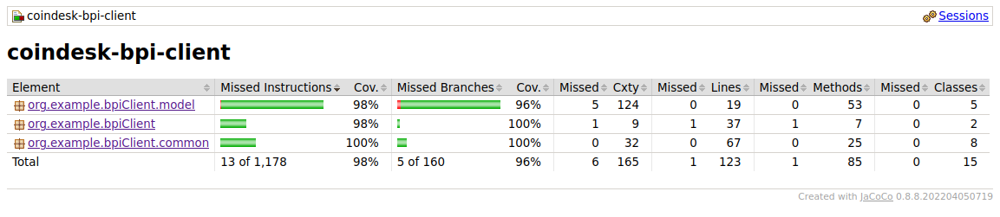

# coindesk-bpi-client
Sample command-line Java program that fetches data from Coindesk BPI API

## Prerequisites

- [x] JDK 11 or later
- [x] Apache Maven 3.5 or later
- [x] docker


## how to build this application

1. clone this repository using git command or alternatively , you may be able to download ZIP archive and extract it

```bash
git clone https://github.com/melanj/coindesk-bpi-client.git
```

2. Use `mvn clean install` to build the package and docker image.

## how to run this application

Using local build JAR file

```bash
java -jar target/coindesk-bpi-client-1.0-SNAPSHOT-jar-with-dependencies.jar
```

Using local build docker image

```bash
docker run -it coindesk-bpi-client:1.0-SNAPSHOT
```
Using a docker image from an image published at https://hub.docker.com/

```bash
docker run -it melannj/coindesk-bpi-client:1.0.0
```

## how to see coverage

Tests can be run using following maven command and test reports are available at 'target/site/jacoco/index.html'

```bash
mvn clean test jacoco:report
```

current test coverage

